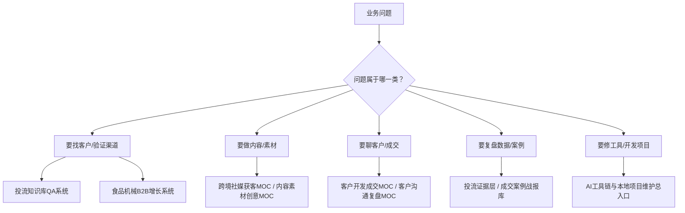

# 业务总控台

## 一句话结论

所有“获客、投流、内容、客户沟通、成交复盘、食品机械增长”任务，先从这里判断要进入哪个系统。

## 当前业务主线

| 主线 | 目标 | 优先入口 | 输出物 |
|---|---|---|---|
| 海外投流 | 用 Facebook、TikTok、LinkedIn 等渠道拿到可跟进线索 | [[投流与视频获客总路由指挥系统]]、[[投流知识库QA系统]] | 投放计划、素材清单、数据复盘 |
| 短视频自然获客 | 用 TikTok、YouTube Shorts、Instagram Reels、Facebook Reels 获取自然询盘 | [[00-海外视频自然获客路由入口]]、[[海外免费流量获客路由入口]] | 选题表、发布计划、私信承接SOP |
| 食品机械 B2B 增长 | 围绕食品加工机械建立选品、内容、投流、承接、成交闭环 | [[食品机械B2B增长系统]]、[[10-食品机械作战MOC]] | 30天增长计划、产品素材、客户开发节奏 |
| 客户开发与成交 | 把线索转成 WhatsApp/LinkedIn 对话、报价、跟进和成交 | [[客户开发与客户服务总览]]、[[食品机械外贸知识如何用于客户成交]] | 客户画像、话术、报价方案 |
| 复盘与案例沉淀 | 把广告数据、客户沟通、成交/失败案例变成可复用资产 | [[投流证据层复盘模板]]、[[00-成交案例复盘模板]]、[[01-失败案例复盘模板]] | 案例卡、失败归因、下轮动作 |
| AI 工具链 | 让 Codex、Claude、OpenClaw、Lark、Telegram 等工具稳定服务业务 | [[AI工具链与本地项目维护总入口]]、[[14-AI工具自动化MOC]] | 工具体检报告、修复清单、自动化任务 |

## 作战路径

## 快速决策表

| 你现在要做什么 | 先读 | 再读 | 最终产出 |
|---|---|---|---|
| 判断食品机械先投哪个平台 | [[投流知识库QA系统]] | [[食品机械B2B增长系统]] | 平台组合建议 |
| 做 Facebook 食品机械广告 | [[03-海外投流火力站/Facebook投流知识库/10-Facebook投流路由入口]] | [[21-食品加工机械Facebook广告素材库]] | 广告结构+素材清单 |
| 做 TikTok/短视频获客 | [[00-海外视频自然获客路由入口]] | [[食品机械海外短视频100选题库]] | 30天内容日历 |
| 把私信导到 WhatsApp | [[08-海外短视频私信承接与WhatsApp转化SOP]] | [[01-WhatsApp对话复盘模板]] | 承接话术+复盘模板 |
| 复盘一次投流 | [[03-海外投流火力站/Facebook投流知识库/17-Facebook投流复盘指标体系]] | [[投流证据层复盘模板]] | 数据诊断和下轮测试 |
| 复盘一次销售机会 | [[00-成交案例复盘模板]] | [[01-失败案例复盘模板]] | 成交/失败案例卡 |
| 查 AI 工具链问题 | [[AI工具链与本地项目维护总入口]] | [[14-AI工具自动化MOC]] | 检查清单或修复任务 |

## 每周运行节奏

1. 周一：选择本周主攻产品、目标市场、获客渠道。
2. 周二到周四：产出素材、发布内容、跑小预算测试或客户开发。
3. 周五：把投流数据、私信、WhatsApp、LinkedIn 进展录入复盘模板。
4. 周六：沉淀 1-3 个案例卡，更新 QA 路由和增长系统缺口。
5. 周日：只做轻量整理，不做大规模结构调整。

## 治理边界

- 本文件是业务入口，不承载具体长文方法论。
- 平台规则、预算、素材、话术进入对应专题文档。
- 批量移动、删除、去重前必须先写报告或 dry-run。
- 真实客户资料、聊天记录、财务数据只做脱敏索引，不直接公开写入。

