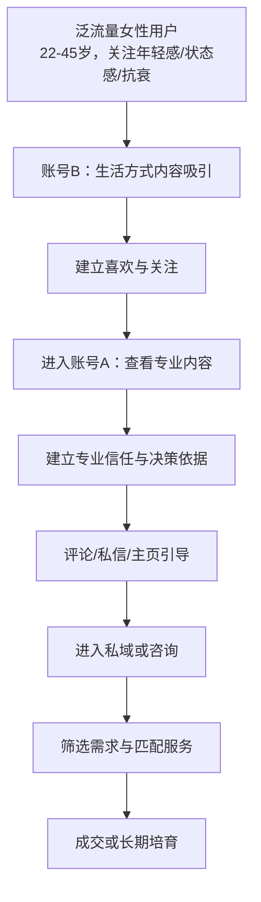
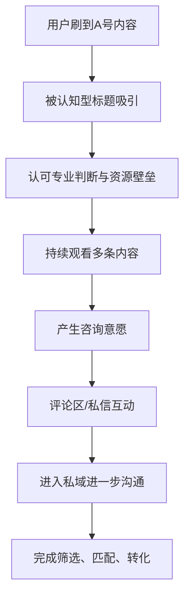
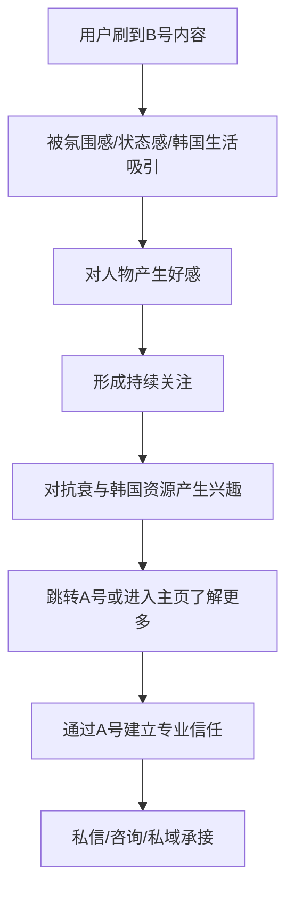

# 医美抗衰双账号规划方案

## 一句话总结
基于客户调研整理的医美抗衰双账号定位方案，包含账号分工、定位、人设、发展方向、对标参考与每号10条选题。

## 核心结论
- 待补充

## 适用场景
- 适合平台：
- 适合行业：
- 适合场景：

## 可复用方法
- 方法 1：待补充
- 方法 2：待补充

## 对我的业务有什么价值
- 对跨境贸易的价值：待补充
- 对 Facebook 投流的价值：待补充
- 对巨量本地推的价值：待补充
- 对客户开发的价值：待补充
- 对知识库沉淀的价值：待补充

## 相关案例
- [[相关案例]]（待补充）

## 后续可提问的问题
- 这个内容适合哪个行业复用？
- 这个策略适合什么平台？
- 这个方法的核心是什么？
- 有什么数据需要补充？
- 有什么风险需要注意？

## 待补充
- 需要补充的数据
- 需要补充的案例
- 需要后续搜索的内容
#待补充
## 一、项目背景

客户核心身份与资源基础：

- 麦迪科医疗科技有限公司创始人
- 中国抗衰品牌“恩再美”创始人
- 具备中韩抗衰美容资源对接能力
- 拥有韩国整形美容产业、韩国美容医院、韩国红参与部分美妆产品授权资源
- 有韩国实地内容素材，包括美容院环境、院长采访、产品展示、跨境场景
- 自身还具备传媒、导演、音乐、钢琴教学等复合标签

目标用户特征：

- 以女性为主，男性为辅
- 年龄集中在 25-50 岁，可向更年轻和更成熟人群延展
- 一二线城市为主
- 收入水平较高，有品质消费、抗衰消费、审美消费能力
- 对年轻感、安全感、正品感、性价比高度敏感

## 二、核心判断

这个客户最适合采用 **双账号矩阵**，并且必须做出明确差异化：

- 一个账号负责建立权威与专业信任
- 一个账号负责建立亲和力与生活方式向往

不建议两个账号都做纯医美科普，否则容易出现：

- 内容重复
- 人设模糊
- 流量互抢
- 后续转化路径不清晰

## 三、双账号总策略

一句话分工：

- **账号A负责让用户相信**
- **账号B负责让用户喜欢**

更具体地说：

- 账号A承接专业判断、认知教育、资源信任、高意向咨询
- 账号B承接生活方式种草、女性情绪共鸣、审美表达、长期影响力

## 四、账号A方案：专业信任型创始人IP

### 1. 账号定位

定位关键词：

- 抗衰认知顾问
- 中韩抗衰资源整合者
- 韩国院线资源观察者
- 高客单抗衰决策辅助者

核心定位表述：

> 不是医生型人设，也不是单纯销售型人设，而是一个帮助用户看懂抗衰、看懂韩国资源、看懂选择逻辑的专业判断型创始人。

### 2. 人设标签

- 创始人
- 资源型女性创业者
- 中韩抗衰行业观察者
- 审美与决策逻辑输出者
- 高净值女性避坑顾问

### 3. 账号气质

- 冷静
- 专业
- 克制
- 有判断力
- 有见识但不过度推销

### 4. 目标用户

- 30-50 岁为主
- 有容颜焦虑但不盲从
- 愿意为安全感、确定性和专业判断买单
- 不希望被低质营销收割

### 5. 适合输出的内容方向

- 抗衰认知教育
- 韩国抗衰消费差异观察
- 决策避坑
- 审美判断
- 院长对话
- 资源型见闻分享

### 6. 发展方向

前期重点：

- 先建立“她懂”而不是“她卖”
- 先塑造信任，再承接私域

中期重点：

- 做高意向咨询筛选
- 沉淀韩国资源信任标签

后期重点：

- 导流私域
- 社群成交
- 资源撮合
- 品牌合作与高客单转化

### 7. 对标账号参考方向

- `天天钻研皮肤的思佳`
- `乐喜研肤`
- `小羽毛比例美学`
- `佳小蔓的逆龄日记`

对标重点不是照搬内容，而是学习：

- 专业感表达方式
- 问题导向型选题结构
- 可信任口播节奏
- 审美判断如何做得高级

### 8. 账号A选题库（10条）

1. 《为什么很多人做了抗衰，还是看起来不高级？》
2. 《真正会抗衰的人，第一步都不是去做项目》
3. 《抗衰最怕的不是贵，而是花了钱还做错方向》
4. 《韩国女性为什么更早开始做年轻化管理？》
5. 《做抗衰前，普通女性一定要先问自己的5个问题》
6. 《为什么我一直强调：抗衰先别急着问价格》
7. 《高客单女性在抗衰上，最在意的其实不是便宜》
8. 《韩国院长更重视的，不是你做什么，而是你为什么做》
9. 《看了这么多案例，我发现大多数人抗衰都忽略了这一点》
10. 《抗衰不是变成别人，而是把你最好的状态找回来》

## 五、账号B方案：亲和生活方式型创始人IP

### 1. 账号定位

定位关键词：

- 年轻态生活方式博主
- 创始人抗衰日常记录者
- 韩国生活方式观察者
- 女性审美与状态感表达者

核心定位表述：

> 这个账号不强调“我有多专业”，而强调“我如何把年轻感活成一种状态”，让用户在内容里感受到松弛感、品位和向往感。

### 2. 人设标签

- 女性创始人
- 抗衰生活方式实践者
- 韩国见闻记录者
- 艺术气质女性
- 年轻态审美表达者

### 3. 账号气质

- 亲和
- 精致
- 松弛
- 有生活感
- 有审美品位

### 4. 目标用户

- 25-45 岁女性为主
- 喜欢看真实体验、生活方式、氛围感内容
- 关注年轻感、气质感、状态管理
- 更容易被“真实的人”打动，而不是被纯知识打动

### 5. 适合输出的内容方向

- 创始人抗衰日常
- 韩国实地vlog
- 女性年轻态价值观
- 气质与审美内容
- 音乐、体态、表情管理
- 生活秩序感与状态管理

### 6. 发展方向

前期重点：

- 让用户先喜欢这个人
- 建立“精致但不端着”的女性创始人形象

中期重点：

- 从个人日常延展到女性成长与年轻态表达
- 形成“状态感”标签

后期重点：

- 做生活方式影响力
- 做高质量女性粉丝沉淀
- 为账号A或私域咨询持续导流

### 7. 对标账号参考方向

- `Qiuu0905`
- `佳小蔓的逆龄日记`
- 高质感女性创始人类账号
- 审美表达型生活方式博主

重点借鉴方向：

- 氛围感表达
- 个人叙事方式
- 女性用户共鸣内容
- 生活方式与商业转化的平衡

### 8. 账号B选题库（10条）

1. 《创业女性的一天，怎么把状态感维持住？》
2. 《我越来越相信，年轻感不是脸，而是整个人的能量》
3. 《在韩国工作时，我最常观察的不是项目，是女生的状态》
4. 《为什么有些女性五官普通，却看起来特别贵气？》
5. 《我的抗衰日常，不激进，但很适合长期坚持》
6. 《真正显年轻的人，都很会管理“疲态”》
7. 《我做这个行业之后，最想劝女性少走的3个弯路》
8. 《去韩国看机构时，我通常会先看什么？》
9. 《学音乐和做审美这两件事，怎么一起影响一个女人的气质？》
10. 《年轻感不是装嫩，是你把生活过得很有秩序》

## 六、客户核心优势提炼

这个客户在内容和生意上的优势，可以统一总结为以下五点：

1. 有明确资源壁垒，不是普通美业从业者，而是具备中韩跨境抗衰资源对接能力
2. 有韩国一手素材，实拍场景、院长采访、环境展示都能增强信任感
3. 有复合型身份，不只有医美标签，还有传媒、导演、音乐、艺术气质标签
4. 用户需求明确，目标人群具备抗衰焦虑、消费能力和决策意愿
5. 适合做高信任、高客单、长决策链路的内容转化

## 七、内容合规提醒

账号内容必须避开以下风险：

- 具体医疗效果承诺
- 绝对化表述
- 夸张功效表达
- 诱导式容貌焦虑表达
- 化妆品或保健品医疗化表达

更适合聚焦的表达方式：

- 抗衰理念
- 韩国消费习惯
- 审美逻辑
- 决策方法
- 使用感受
- 个人见闻
- 状态管理与生活方式

> [!warning] 合规重点
> 账号内容尽量避免使用“几天见效”“百分百有效”“立刻年轻”“安全无风险”等高风险表述。重点做认知教育、生活方式表达与决策避坑。

## 八、操盘建议

执行建议：

- 前30天不急着强卖货，重点打基础认知
- 先把双账号差异化做清楚
- 账号A优先建立专业可信标签
- 账号B优先建立生活方式向往标签
- 后续通过评论区、私信、私域承接高意向用户

建议的总原则：

> A号讲判断，B号讲状态。  
> A号做信任，B号做喜欢。  
> A号偏成交前教育，B号偏成交前种草。

## 九、人群分层与账号承接逻辑

### 1. 核心判断

这套双账号不建议只盯“新入医美用户”，也不建议只服务“长期重度医美用户”。

更准确的人群定位应该是：

> 以 **有抗衰意识的轻熟龄决策用户** 为核心，同时覆盖抗初老人群与长期保养升级人群。

这类用户的共性是：

- 已经开始关注松弛、肤质、轮廓、疲态、年轻感
- 有一定消费能力
- 不一定是纯医美小白，但也未必建立了成熟决策体系
- 想变好，但怕踩坑
- 更看重安全感、正品感、审美感和确定性

### 2. 三层用户结构

#### 第一层：认知萌芽人群

用户特征：

- 22-30 岁为主
- 对抗初老、皮肤管理、韩系审美、生活方式感兴趣
- 更容易被氛围感、状态感、真实生活内容吸引
- 还没有进入很深的医美决策阶段

核心需求：

- 建立对“年轻感”的认知
- 获得轻度种草
- 对抗衰形成兴趣，而不是立刻购买

适合承接账号：

- 账号B为主

#### 第二层：轻决策人群

用户特征：

- 28-40 岁为主
- 有明确抗衰焦虑
- 可能接触过护肤、轻项目、基础保养
- 已经开始做功课，但不敢随便下决策

核心需求：

- 想知道什么适合自己
- 想知道该怎么选
- 想避坑
- 想找到更可信、更稳妥的路径

适合承接账号：

- 账号A与账号B共同承接
- B号吸引，A号完成教育和说服

#### 第三层：深度决策人群

用户特征：

- 35-50 岁为主
- 长期保养意识更强
- 消费能力高
- 更关注审美匹配、资源真实性、服务质量和长期结果

核心需求：

- 更高层次的判断与信任
- 更细的个性化咨询
- 更稳定的资源对接和服务体验

适合承接账号：

- 账号A为主

### 3. 双账号承接关系

更适合的表述不是“一个讲知识，一个讲体验”，而是：

- **账号A**：抗衰决策顾问型账号
- **账号B**：年轻态生活方式型账号

双账号联动逻辑：

- B号负责吸引更广泛的关注与兴趣
- A号负责建立专业信任与决策依据
- 两个账号共同把用户引导到私域或咨询环节

## 十、内容结构表

### 账号A：专业信任型创始人IP内容结构表

| 模块 | 内容目标 | 主要内容方向 | 用户心理 | 适合形式 |
| --- | --- | --- | --- | --- |
| 抗衰认知 | 建立专业判断力 | 年轻感底层逻辑、抗衰常见误区、衰老问题拆解 | 我想知道自己到底该看什么问题 | 口播、图文口播、清单式表达 |
| 决策避坑 | 降低用户试错成本 | 做项目前先看什么、如何判断适不适合、怎么少走弯路 | 我怕花钱做错 | 口播、问答、案例拆解 |
| 中韩差异观察 | 强化跨境资源价值 | 韩国抗衰理念、消费习惯、审美差异、流程差异 | 韩国到底好在哪里 | 口播、实拍混剪、旁白解释 |
| 院长对话 | 建立权威感与稀缺感 | 院长采访、机构沟通重点、专业视角输出 | 她是真的接触核心资源的人 | 对话访谈、字幕切条、观点摘录 |
| 审美判断 | 提升账号高级感 | 年轻感与高级感、轮廓与疲态、过度医美风险 | 我不想变假，我想变自然 | 口播、案例观点、审美点评 |
| 高意向引导 | 承接咨询与转化 | 常见咨询问题、筛选逻辑、如何做好前期判断 | 如果我想进一步了解，该怎么开始 | 口播结尾引导、评论区互动、私信承接 |

### 账号A内容比例建议

- 抗衰认知：30%
- 决策避坑：25%
- 中韩差异观察：15%
- 院长对话：15%
- 审美判断：10%
- 高意向引导：5%

### 账号A核心作用

- 不是单纯输出知识
- 而是帮助用户建立“判断、选择、审美、确定性”四个维度的信任

### 账号B：亲和生活方式型创始人IP内容结构表

| 模块 | 内容目标 | 主要内容方向 | 用户心理 | 适合形式 |
| --- | --- | --- | --- | --- |
| 创始人日常 | 建立真实感与陪伴感 | 工作日常、出差日常、状态管理、女性自律 | 我想看她真实怎么生活 | vlog、口播、日常切片 |
| 年轻态表达 | 输出价值观与共鸣 | 年轻感、状态感、松弛感、疲态管理 | 我也想活成这种状态 | 口播、情绪型文案、轻叙事 |
| 韩国见闻 | 制造稀缺性与新鲜感 | 韩国美容院环境、街头观察、当地审美与生活方式 | 韩国女性到底是怎么保养的 | 实拍混剪、旁白、轻vlog |
| 体验记录 | 增强可信度与代入感 | 个人体验、观察记录、过程感受 | 她是真实接触和体验过的 | 记录式vlog、混剪、体验口播 |
| 气质与审美 | 打造差异化标签 | 音乐、体态、表情管理、精致感来源 | 变年轻不只是项目，是整体状态 | 口播、镜头表达、生活片段 |
| 软性导流 | 将兴趣导向更深认知 | 提到A号、评论区引导、日常中提到专业判断 | 我先喜欢她，再去看她更专业的内容 | 联动口播、结尾引导、账号互推 |

### 账号B内容比例建议

- 创始人日常：25%
- 年轻态表达：20%
- 韩国见闻：20%
- 体验记录：20%
- 气质与审美：10%
- 软性导流：5%

### 账号B核心作用

- 不是直接卖项目
- 而是先让用户觉得这个人可信、舒服、值得持续关注
- 最终把“向往感”转化成“进一步了解的意愿”

## 十一、转化路径图

### 1. 双账号总转化逻辑

### 2. 账号A转化路径

### 3. 账号B转化路径

### 4. 实际运营中的联动建议

- B号视频结尾可以自然提到“这个问题我在另一个号里讲得更细”
- A号可偶尔引用B号中的真实场景与韩国素材，增强真实感
- 两个账号主页简介和置顶内容要体现关联关系
- B号负责降低距离感，A号负责降低决策风险

### 5. 私域前的转化目标

短视频阶段最重要的，不是立刻成交，而是完成以下三个动作：

1. 让用户愿意看第二条
2. 让用户愿意点进主页
3. 让用户愿意私信或留下咨询意向

只要这三个动作顺畅，后续私域和高客单转化才有基础

## 十二、后续可继续扩写的模块

这篇笔记后续可以继续补充：

- 每条选题的口播大纲
- 每个账号前7天发布排期
- 每个账号的昵称、简介、Slogan
- 首页5件套包装方案
- 私域转化路径设计
- 对标账号逐个拆解表

## 十三、关联笔记

- [[海外全域社媒IP课程]]

## 相关知识点
- [[国内业务]]
- [[国内社媒]]
- [[客户服务]]
- [[账号运营]]
- [[客户档案]]
