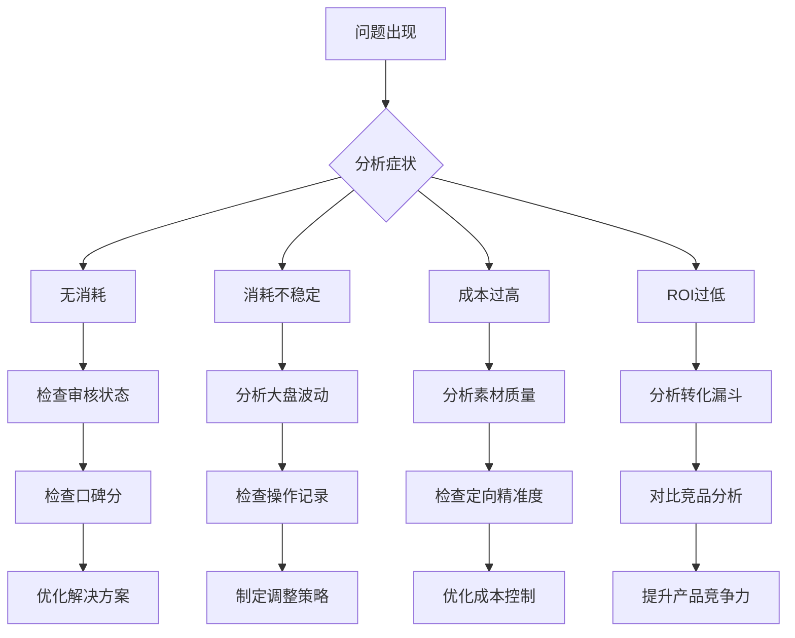

# 巨量本地推投流体系

## 一句话总结
巨量-巨量本地推投流体系_Obsidian格式文档

## 核心结论
- 待补充

## 适用场景
- 适合平台：
- 适合行业：
- 适合场景：

## 可复用方法
- 方法 1：待补充
- 方法 2：待补充

## 对我的业务有什么价值
- 对跨境贸易的价值：待补充
- 对 Facebook 投流的价值：待补充
- 对巨量本地推的价值：待补充
- 对客户开发的价值：待补充
- 对知识库沉淀的价值：待补充

## 相关案例
- [[相关案例]]（待补充）

## 后续可提问的问题
- 这个内容适合哪个行业复用？
- 这个策略适合什么平台？
- 这个方法的核心是什么？
- 有什么数据需要补充？
- 有什么风险需要注意？

## 待补充
- 需要补充的数据
- 需要补充的案例
- 需要后续搜索的内容
#待补充
## 概述
巨量本地推是抖音为本地商家打造的精准营销工具，专注于门店到店核销和团购转化。

## 核心概念
- **定位差异**：与巨量引擎AD相比，本地推更专注本地门店到店转化
- **适用主体**：实体门店（需认领抖音来客门店）
- **地域限制**：有严格地域限制，聚焦周边3-5公里
- **核心目标**：到店核销/团购转化

## 模块导航
- [[#账户结构与基础设置]]
- [[#出价逻辑与预算分配]]
- [[#定向策略配置]]
- [[#素材策略与测试]]
- [[#起量与放量SOP]]
- [[#优化排查手册]]
- [[#数据指标体系]]
- [[#常见踩坑与避坑]]


## 出价逻辑与预算分配

### 预算设置原则
```formula
新计划预算 = 目标成本 × 20
```
- 例：目标成本100元/单 → 日预算≥2000元

### 出价策略框架
| 阶段 | 出价策略 | 调整幅度 |
|------|----------|----------|
| 新计划初期 | 高于同行5-10% | 保持稳定 |
| 学习期后 | 逐步调整至目标 | 每次<10% |
| 成熟期 | 系统建议±5% | 微调优化 |
| 竞争期 | 竞争出价模式 | 灵活调整 |

### 智能放量配置
- 开启条件：计划稳定跑量后
- 配合措施：适当提高出价
- 监控指标：新人群转化效果


## 素材策略与测试

### 素材创作公式
```
高转化素材 = 真实场景 + 情感共鸣 + 行动引导
```

### 六大标题模板
1. **热点法**："同城爆火的XX店，刷屏了！"
2. **数字法**："3公里内300+人打卡的宝藏店"
3. **共鸣法**："本地人才知道的隐藏福利"
4. **利益法**："新店开业5折套餐，限时抢"
5. **疑问法**："这家店凭什么让老饕们排队2小时？"
6. **对比法**："比网红店更便宜，比街边摊更精致"

### AB测试规范
```yaml
测试原则:
  - 同一计划内测试
  - 单一变量原则
  - 足够样本量

测试维度:
  - 封面设计
  - 标题文案
  - 剪辑风格
  - 背景音乐
```


## 优化排查手册

### 问题诊断流程图


### 常见问题速查表
| 症状 | 快速检查 | 应急处理 |
|------|----------|----------|
| 突然无消耗 | 1. 审核状态<br>2. 口碑分<br>3. 账户余额 | 1. 重新提交审核<br>2. 提升评分<br>3. 及时充值 |
| 成本飙升 | 1. 出价设置<br>2. 竞争环境<br>3. 素材效果 | 1. 调整出价<br>2. 设置预算限制<br>3. 更换素材 |
| ROI持续下降 | 1. 转化漏斗<br>2. 产品竞争力<br>3. 市场变化 | 1. 优化承接页<br>2. 调整产品策略<br>3. 测试新方向 |


## 常见踩坑与避坑

### 十大常见坑位
1. **冷启动频繁调整** → 保持3天观察期
2. **预算设置过低** → 目标成本×20倍
3. **定向范围过宽** → 3-5公里起步
4. **素材强营销属性** → 种草风格优先
5. **跨计划AB测试** → 同计划内测试
6. **忽视口碑分限制** → 日常维护评分
7. **盲目跟从建议出价** → 结合经验调整
8. **计划补充不及时** → 建立计划库
9. **数据分析表面化** → 建立分析体系
10. **合规打擦边球** → 严格遵守规则

### 风险预防矩阵
| 风险类型 | 发生概率 | 影响程度 | 预防措施 | 应急方案 |
|----------|----------|----------|----------|----------|
| 账户处罚 | 低 | 高 | 定期学习规则<br>严格内容审核 | 申诉流程<br>备用账户 |
| 成本失控 | 中 | 高 | 设置预算预警<br>出价上限控制 | 立即暂停<br>重新评估 |
| 流量断层 | 高 | 中 | 建立计划库<br>提前储备素材 | 快速上新<br>调整策略 |
| 数据误判 | 中 | 中 | 建立分析体系<br>多维度验证 | 重新分析<br| 专家咨询 |
| 团队失误 | 低 | 中 | 标准化流程<br>定期培训 | 及时纠正<br>经验沉淀 |


## 高频问题Q&A

### 基础操作类
**Q：开户需要哪些资质？**
A：营业执照、法人身份证、对公账户信息，特殊行业需附加资质。

**Q：如何查看投放数据？**
A：抖音来客APP → 营销推广 → 本地推广 → 数据报表。

**Q：官方客服联系方式？**
A：4006181518（服务时间8:30-21:30）。

### 优化策略类  
**Q：新账户如何快速起量？**
A：自动控制模式+足够预算+精准定向+7天观察期。

**Q：素材审核不通过怎么办？**
A：避免强营销元素，采用种草风格，参考官方审核规则。

**Q：如何提升ROI？**
A：优化素材吸引力+精准定向人群+合理出价预算+DMP人群包。

### 问题处理类
**Q：计划消耗不稳定怎么办？**
A：拉长观察周期，避免频繁调整，结合直播间节奏优化。

**Q：什么时候应该关停计划？**
A：衰退明显、成本超标、素材质量低下时。

**Q：如何利用DMP人群包？**
A：冷启动期圈选类目精准人群，配合智能放量提高转化。


## 更新日志
- **2026-04-22**：知识库初版创建，基于公开资料整理
- **计划更新**：每月根据实战经验更新优化策略

## 贡献指南
欢迎通过以下方式完善本知识库：
1. 补充实战案例和经验
2. 修正过时信息
3. 添加新的优化方法
4. 分享踩坑教训

## 关联笔记
- [[03-国内投流/MOC]]
- [[03-国内投流/投流体系/巨量本地推_通用方法论]]
- [[03-国内投流/投流体系/巨量本地推_行业打法卡库]]
- [[03-国内投流/投流体系/巨量本地推_新客户接入诊断表]]
- [[03-国内投流/投流体系/巨量-巨量本地推投流体系知识库]]

---

## 起量与放量 SOP（深度版）

### 冷启动 7 天详细操作指南

| 天 | 操作 | 关注指标 | 异常处理 |
|----|------|---------|---------|
| Day 1 | 建计划，确认审核通过 | 曝光量 | 无曝光 → 查审核/出价/定向 |
| Day 2 | 不碰计划 | 曝光 → 点击漏斗 | 有曝光无点击 → 查素材 |
| Day 3 | 不碰计划 | CTR/团购下单量 | CTR < 2% → 换封面/标题 |
| Day 4 | 首次评估 | CPA/消耗率 | CPA > 目标×1.5 → 微调出价 -5% |
| Day 5 | 观察趋势 | 成本趋势 | 成本稳定 → 保持 |
| Day 6 | 观察趋势 | ROI | ROI > 目标 → 准备放量 |
| Day 7 | 决策日 | 整体数据 | 通过学习 → 复制计划放量 |

### 放量三阶段

```
阶段1：试探性放量（Day 8-14）
  → 复制跑量计划 2-3 条
  → 每条新计划预算 = 原计划的 50%
  → 开启智能放量

阶段2：稳定放量（Day 15-30）
  → 确认新计划 CPA 稳定
  → 原计划预算 +20%
  → 每周更新素材 5-10 条

阶段3：规模化放量（Day 30+）
  → 在投计划 20-30 条
  → 建立素材生产流水线
  → 按行业打法卡优化定向
```

---

## 数据指标体系（深度版）

### 本地推专属指标

| 指标 | 含义 | 在哪看 | 健康基准 |
|------|------|--------|---------|
| **曝光量** | 广告展示次数 | 数据报表 | 日均 10,000+ |
| **CTR** | 点击率 | 数据报表 | > 3% 合格 |
| **团购下单量** | 用户购买团购券数 | 抖音来客 | 日均 10+ |
| **核销率** | 购买后到店使用的比例 | 抖音来客 | > 60% |
| **有效核销 ROI** | 核销 GMV / 消耗 | 手动计算 | > 1.5 |
| **口碑分** | 门店服务质量评分 | 抖音来客 | ≥ 4.6 |

### 漏斗健康判断

```
曝光 → 点击（CTR > 3%）→ 团购下单（CVR > 1%）→ 到店核销（> 60%）

如果曝光→点击断了 → 素材问题
如果点击→下单断了 → 团购商品问题（价格/描述/评价）
如果下单→核销断了 → 门店体验问题（位置/预约/服务）
```

---

## 素材策略与测试（深度版）

### 本地推素材 6 大创作公式

| 公式 | 结构 | 适用品类 |
|------|------|---------|
| **探店式** | 到店体验 → 展示产品 → 感受评价 | 餐饮/美业 |
| **对比式** | 以前 vs 现在 / 这家 vs 那家 | 美业/家装 |
| **教程式** | 教你怎么做/怎么选 | 教培/家装 |
| **故事式** | 真实顾客的故事 | 所有品类 |
| **悬念式** | 开头设悬念 → 结尾揭晓 | 餐饮/娱乐 |
| **清单式** | "XX 必做的 N 件事" | 旅游/娱乐 |

### 素材审核红线

| 违规类型 | 常见触发 | 替代方案 |
|---------|---------|---------|
| 强营销 | 价格/促销信息 | 用"团购链接"替代口播价格 |
| 虚假宣传 | "最便宜""最好" | 用"性价比高""口碑好" |
| 联系方式 | 电话/微信/二维码 | 用抖音私信/团购链接 |
| 医疗承诺 | "根治""100%有效" | 用"帮助改善""咨询了解" |

---

## 常见踩坑与避坑（深度版）

### 预算与出价坑

| 坑 | 症状 | 解法 |
|----|------|------|
| 预算撞线 | 计划中午就没消耗了 | 预算 = 目标成本 × 20 |
| 出价过高 | 成本远超目标 | 每次降 5-10%，不一步到位 |
| 出价过低 | 完全花不出去 | 提高到行业均值 + 10% |
| 频繁调价 | 计划持续不稳定 | 冷启动期 7 天不碰参数 |

### 定向坑

| 坑 | 症状 | 解法 |
|----|------|------|
| 范围太宽 | 有曝光无转化 | 缩小到 3-5 公里 |
| 范围太窄 | 曝光量极低 | 扩大到 5-8 公里 |
| 标签太多 | 覆盖人群趋近于 0 | 减少到 3-5 个核心标签 |
| 标签太泛 | 转化率极低 | 叠加行业精准标签 |

### 素材坑

| 坑 | 症状 | 解法 |
|----|------|------|
| 硬广风格 | CTR < 2% | 改为种草 vlog 风格 |
| 前5秒平淡 | 3 秒留存 < 30% | 加悬念/视觉冲击 |
| 没有 CTA | 有点击无下单 | 加"点击左下角团购"引导 |
| 素材过期 | 跑了 15 天+ CTR 下降 | 更新素材（封面/标题） |

---

## 实战案例

### 案例1：社区咖啡店从0到日核销50单

| 阶段 | 时间 | 动作 | 结果 |
|------|------|------|------|
| 冷启动 | Week 1 | 3 条计划 × 团购成交目标，预算 500 元/天 | 日核销 5-10 单 |
| 放量 | Week 2-3 | 复制到 8 条计划，开启智能放量 | 日核销 20-30 单 |
| 稳定 | Week 4+ | 在投 15 条，每周更新素材 5 条 | 日核销 50+ 单，ROI 2.5x |

### 案例2：舞蹈培训机构获客成本从150降到65元

| 优化项 | 优化前 | 优化后 | 变化 |
|--------|--------|--------|------|
| 定向 | 全城 18-50 岁 | 周边 5 公里 28-42 岁女 | CPA -35% |
| 素材 | 精修广告片 | 学员真实课堂录像 | CTR +80% |
| 团购 | 正价课直接卖 | 9.9 元体验课 | CVR +200% |
| 出价 | 固定出价 | 自动控成本 | 稳定性 +50% |


## 相关知识点
- [[巨量本地推]]
- [[国内投流]]
- [[投流策略]]
- [[广告素材]]
- [[投流案例]]
