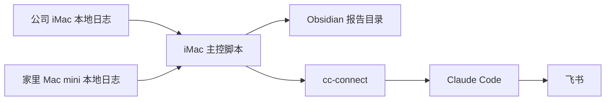

# AI 用量统计系统配置与维护说明

> [!summary] 总结
> 当前 AI 用量统计系统已在 `公司 iMac` 上作为主控运行，负责定时生成日报、周报、月报、最新汇总，并通过 `cc-connect -> Claude Code -> 飞书` 发送报告。  
> 采集层仍保留双机架构：`公司 iMac` 与 `家里 Mac mini` 各自在本机读取自己的日志；当 Mac mini 在线时自动并入统计，离线时 iMac 仍继续生成报告，并在报告中标记该设备本次未采集。  
> 当前正式归因口径为：`Claude Code / OpenClaw / cc-connect / Codex` 四路分开统计。  
> 2026-05-18 已完成一次完整验收：生成、写入 Obsidian、上一周重跑、双机汇总、`cc-connect` 独立归因、真实飞书发送均已跑通。

## 1. 当前架构



| 层级 | 当前方案 |
| --- | --- |
| 主控层 | 公司 iMac |
| 执行层 | 公司 iMac |
| 采集层 | 双机本地采集 |
| 存储层 | Obsidian 指定目录 |
| 发送层 | `cc-connect -> Claude Code -> 飞书` |
| 归因层 | `Claude Code / OpenClaw / cc-connect / Codex` |

## 2. 报告输出位置

根目录：

```text
/Users/mac/ai-workspaces/AI-Workspace-Obsidian/15-AI自动化工兵营/AI用量统计/
```

当前主要文件：

- `最新汇总.md`
- `日报/AI用量统计-daily-YYYY-MM-DD.md`
- `周报/AI用量统计-weekly-YYYY-MM-DD~YYYY-MM-DD.md`
- `月报/AI用量统计-monthly-YYYY-MM.md`
- `AI用量统计系统配置与维护说明.md`

## 3. 当前正式脚本

### 3.1 运行副本

系统真正执行的是：

```text
/Users/mac/.local/bin/ai_usage_report.py
/Users/mac/.local/bin/deliver_ai_usage_report.py
```

### 3.2 源码备份副本

维护时优先查看：

```text
/Users/mac/Documents/New project 2/ai-usage-reporting/
```

其中包含：

- `ai_usage_report.py`
- `deliver_ai_usage_report.py`
- `com.openai.ai-usage-report.plist`
- `com.openai.ai-usage-delivery-daily.plist`
- `com.openai.ai-usage-delivery-weekly.plist`
- `com.openai.ai-usage-delivery-monthly.plist`
- `README.md`

> [!note]
> 2026-05-18 调整过程中，源码目录曾一度被外部变更清掉，但运行副本仍在。之后已重新把源码目录补回，后续维护时应同时保留“源码副本”和“运行副本”两套。

## 4. 调度配置

调度文件位置：

```text
/Users/mac/Library/LaunchAgents/
```

| 任务 | 配置文件 | 时间 |
| --- | --- | --- |
| 刷新日报 / 周报 / 月报 / 最新汇总 | `com.openai.ai-usage-report.plist` | 每天 `23:55` |
| 发送日报 | `com.openai.ai-usage-delivery-daily.plist` | 每天 `08:00`，发送前一天日报 |
| 发送周报 | `com.openai.ai-usage-delivery-weekly.plist` | 每周一 `08:00`，发送上一周周报 |
| 发送月报 | `com.openai.ai-usage-delivery-monthly.plist` | 每月 `1` 日 `08:00`，发送上一月月报 |

查看当前是否加载：

```bash
launchctl list | grep -E 'com.openai.ai-usage|com.cc-connect'
```

## 5. 数据采集口径

| Agent | 当前采集方式 |
| --- | --- |
| `Claude Code` | 读取 `~/.claude/projects/**/*.jsonl` |
| `OpenClaw` | 从 Claude 会话 `cwd` 中含 `.openclaw` 的记录归因 |
| `cc-connect` | 通过 `~/.cc-connect/sessions/*.json` 中的 `agent_session_id` 反查 Claude 会话并重新归因 |
| `Codex` | 读取 `~/.codex/state_5.sqlite` 与 rollout 文件 |

### 5.1 `cc-connect` 为什么单独归因

最初 `cc-connect` 发起的 Claude 会话会被吞进 `Claude Code`，导致三类问题：

1. Claude Code 数字虚高
2. 无法看清飞书桥接流量
3. 无法评估 `cc-connect` 的真实工具调用与 token 占比

2026-05-18 已改成单独归因：

- 家里 Mac mini 新部署：可通过日志和工作区识别
- 公司 iMac 老部署：通过 `~/.cc-connect/sessions/*.json` 中的 `agent_session_id` 回查对应 Claude 会话

这样即使老版 `cc-connect` 没有完整 turn 级结构化日志，也能统计出：

- 会话数
- 消息数
- 工具调用
- Input Tokens
- Output Tokens
- Total Tokens

## 6. 当前生成内容

每份报告都包含：

1. 总表
2. 按 Agent 统计
3. 按模型统计
4. 按项目统计
5. 按设备统计
6. 工具调用量统计
7. 异常用量分析
8. 节省建议
9. 数据完整性说明

标准表头：

| Agent | 会话数 | 消息数 | 工具调用 | Input Tokens | Output Tokens | Total Tokens |
| --- | --- | --- | --- | --- | --- | --- |

## 7. 2026-05-18 实际完成的调整

### 7.1 架构调整

1. 最初尝试把家里 Mac mini 设为主控
2. 因 Mac mini 网络与 SSH 不稳定，改为由 `公司 iMac` 先承担主控和执行层
3. 双机本地采集仍保留
4. Mac mini 离线时，iMac 继续正常出报告，并在报告中标记采集状态

### 7.2 发送链路调整

旧链路：

```text
OpenClaw -> 飞书
```

现链路：

```text
cc-connect -> Claude Code -> 飞书
```

发送脚本已改为：

```bash
~/.local/bin/cc-connect send --stdin
```

### 7.3 归因调整

旧口径：

```text
Claude Code / OpenClaw / Codex
```

新口径：

```text
Claude Code / OpenClaw / cc-connect / Codex
```

### 7.4 容错调整

远端 Mac mini 不可达时：

- 不再让整套报表失败
- 报告仍继续生成
- 数据完整性说明中会标记：
  - `公司 iMac：已采集`
  - `家里 Mac mini：远程不可达，本次未采集`

## 8. 验收结果

2026-05-18 已完成：

- 报告生成成功
- Obsidian 写入成功
- 日报 / 周报 / 月报 / 最新汇总成功
- 上一周重跑成功
- `cc-connect` 独立归因成功
- 双机汇总成功
- 真实飞书发送成功

上一周新版统计：

| Agent | 会话数 | 消息数 | 工具调用 | Total Tokens |
| --- | ---: | ---: | ---: | ---: |
| Claude Code | 253 | 9,317 | 3,253 | 116,584,018 |
| OpenClaw | 0 | 0 | 0 | 0 |
| cc-connect | 17 | 1,484 | 713 | 31,165,549 |
| Codex | 47 | 406 | 896 | 57,667,779 |
| 合计 | 317 | 11,207 | 4,862 | 205,417,346 |

对应报告：

- [[AI用量统计-weekly-2026-05-11~2026-05-17]]

## 9. 常用手工命令

### 9.1 立即刷新当前日报 / 周报 / 月报 / 最新汇总

```bash
python3 ~/.local/bin/ai_usage_report.py
```

### 9.2 以某一天为基准重跑报告

```bash
python3 ~/.local/bin/ai_usage_report.py --today 2026-05-17
```

### 9.3 发送上一周周报

```bash
python3 ~/.local/bin/deliver_ai_usage_report.py weekly --today 2026-05-18
```

### 9.4 只看当前调度是否存在

```bash
launchctl list | grep -E 'com.openai.ai-usage|com.cc-connect'
```

### 9.5 看最新报告文件

```bash
find "/Users/mac/ai-workspaces/AI-Workspace-Obsidian/15-AI自动化工兵营/AI用量统计" \
  -maxdepth 2 -type f -name "*.md" -print0 | xargs -0 ls -lt | head
```

## 10. 如果以后要迁回 Mac mini

迁回前建议先确认 4 件事：

1. Mac mini SSH 长时间稳定
2. Mac mini 上 `cc-connect` 已由 launchd 正式托管
3. Mac mini 可以反向 SSH 到 iMac
4. Mac mini 可稳定写回当前 Obsidian 目录

迁回时要改的地方：

1. `ai_usage_report.py`
   - 主控逻辑切回 Mac mini
   - 由 Mac mini 远程拉取 iMac 本地采集结果
2. `deliver_ai_usage_report.py`
   - 改回使用 Mac mini 上的 `cc-connect`
3. `LaunchAgents`
   - iMac 上卸载报告任务
   - Mac mini 上加载报告任务
4. 报告文档中同步更新“当前主控机”

## 11. 排障顺序

### 11.1 没有生成报告

先查：

```bash
tail -n 80 ~/Library/Logs/ai-usage-report.err.log
tail -n 80 ~/Library/Logs/ai-usage-report.log
```

### 11.2 飞书没收到

先查：

```bash
launchctl list | grep com.cc-connect
tail -n 80 ~/.cc-connect/logs/cc-connect.log
tail -n 80 ~/.cc-connect/logs/cc-connect.stdout.log
```

再手工测：

```bash
python3 ~/.local/bin/deliver_ai_usage_report.py weekly --today 2026-05-18
```

### 11.3 家里 Mac mini 没进统计

先查：

```bash
ssh -o BatchMode=yes -o ConnectTimeout=8 a1@172.24.49.53 'hostname; date'
```

如果不可达：

- 报告仍应正常生成
- 只是报告里会标记 Mac mini 本次未采集

### 11.4 `cc-connect` 显示为 0

优先检查：

1. `~/.cc-connect/sessions/*.json` 是否存在
2. 会话里是否有 `agent_session_id`
3. Claude 会话 JSONL 是否仍在
4. 是否把 `cc-connect` 会话又误归到了 `Claude Code`

## 12. 当前关键路径清单

| 作用 | 路径 |
| --- | --- |
| 运行脚本 | `/Users/mac/.local/bin/ai_usage_report.py` |
| 发送脚本 | `/Users/mac/.local/bin/deliver_ai_usage_report.py` |
| 源码目录 | `/Users/mac/Documents/New project 2/ai-usage-reporting/` |
| 报告根目录 | `/Users/mac/ai-workspaces/AI-Workspace-Obsidian/15-AI自动化工兵营/AI用量统计/` |
| LaunchAgents | `/Users/mac/Library/LaunchAgents/` |
| iMac cc-connect 日志 | `/Users/mac/.cc-connect/logs/` |
| iMac cc-connect 会话 | `/Users/mac/.cc-connect/sessions/` |
| iMac Codex 数据库 | `/Users/mac/.codex/state_5.sqlite` |
| iMac Claude Code 会话 | `/Users/mac/.claude/projects/` |

## 13. 后续维护原则

1. 优先保证 iMac 主流程稳定，不让远端机器拖垮日报和发送
2. 双机采集保持，但允许远端短时缺失
3. `cc-connect` 必须独立统计，不再并回 Claude Code
4. 修改脚本时同时更新：
   - 运行副本
   - 源码副本
   - 本文档
5. 每次大改后至少做 3 个验收：
   - 生成报告
   - 检查 Obsidian 文件
   - 真发一条飞书

## 14. 相关文稿

- [[最新汇总]]
- [[AI用量统计-weekly-2026-05-11~2026-05-17]]
