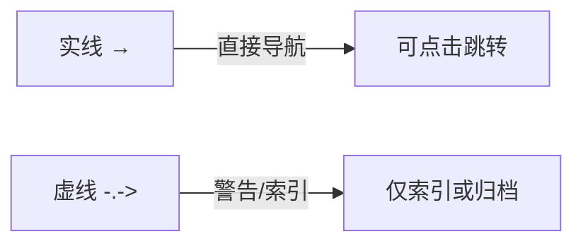

# AI工具配置关系图谱

> [!info] 本文档用途
> 本文档以 Mermaid 图谱和 Obsidian Canvas 两种形式，展示 `10-AI工具配置` 目录下各核心文档之间的层次关系与导航结构。
>
> 视觉版本：[[AI工具配置关系图谱.canvas]]

---

## 如何阅读这张图谱

### 节点类型说明

| 节点类型 | 含义 |
|---------|------|
| **总入口 (MOC)** | 该目录的顶层导航页，是内容组织的最高级别 |
| **配置入口** | 对应工具的配置总览页 |
| **技能索引** | Skills 分类索引或学习指南 |
| **工作流入口** | 某类工作流的总览页面 |
| **Memory 说明** | Memory/会话相关的说明文档 |
| **仅索引** | 内容仅做索引，不展开具体用法 |
| **归档模板** | 已废弃或待清理的模板文件 |

### 导航优先级

1. **总入口 (MOC)** → 本目录所有内容的顶层入口
2. **各配置/技能/工作流 MOC** → 各子目录的入口
3. **具体文档** → 叶子节点，直接对应实际操作

---

## Mermaid 图谱

```mermaid
graph TB
    subgraph root["📁 根目录 (10-AI工具配置)"]
        MOC["[[MOC]]\n总入口"]
    end

    subgraph codex["📁 Codex配置"]
        CodexMOC["[[Codex配置/Codex 配置与技能体系 MOC]]\nCodex 配置与技能体系入口"]
        CodexSkillsIdx["[[Codex配置/Codex Skills 学习索引]]\nSkills 分类索引"]
        PersonalSkillsIdx["[[Codex配置/个人自定义 Skills 索引]]\n自定义 Skills 索引"]
        ObsidianWorkflow["[[Codex配置/Obsidian相关 Skills 工作流]]\nObsidian 工作流"]
        CodexWorkflow["[[Codex配置/Codex-Claude-Obsidian整理工作流]]\nCodex 协作工作流"]
        CodexOverview["[[Codex配置/Codex目录结构与配置总览]]\nCodex 目录总览"]
    end

    subgraph workflows["📁 工作流"]
        WF_MOC["[[工作流/00_Workflows_MOC]]\n工作流总入口"]
        Hermes_WF["[[工作流/Hermes技能体系/Hermes技能体系 MOC]]\nHermes 技能体系"]
        CC_WF["[[工作流/ClaudeCode工作流/2026-05-02 Claude Code 与 Obsidian Sync 选型]]\nClaude Code 选型"]
        OC_WF["[[工作流/OpenClaw工作流/04-OpenClaw使用流程]]\nOpenClaw 使用流程"]
        Feishu_WF["[[工作流/飞书工作流/飞书工作流]]\n飞书工作流 ⚠️仅索引"]
        Nuwa_WF["[[工作流/飞书工作流/女娲工作流]]\n女娲工作流 ⚠️仅索引"]
    end

    subgraph memory["📁 Memory与会话"]
        Mem["[[Memory与会话/Codex Memory 与会话资料说明]]\nMemory 会话说明"]
        MemManage["[[Memory与会话/Claude Manage Memory]]\nClaude Memory 管理"]
    end

    subgraph agents["📁 Agent 配置"]
        ClaudeCfg["[[Claude配置/ClaudeCode配置]]\nClaude Code 配置"]
        HermesCfg["[[Hermes配置/awesome-hermes-agent]]\nHermes 配置"]
        OpenClawCfg["[[OpenClaw配置/openclaw 模型使用情况全部]]\nOpenClaw 配置"]
    end

    subgraph archive["📁 归档/待清理"]
        Tpl1["[[归档/待清理模板/obsidian_generate_moc]]\n生成 MOC 模板 ⚠️"]
        Tpl2["[[归档/待清理模板/obsidian_restructure_dry_run]]\n重组干运行 ⚠️"]
        Tpl3["[[归档/待清理模板/obsidian_suggest_tags]]\n标签建议模板 ⚠️"]
        Tpl4["[[归档/待清理模板/obsidian_weekly_intel_summary]]\n周报摘要模板 ⚠️"]
        Tpl5["[[归档/待清理模板/New obsidian_automation_templates]]\n自动化模板 ⚠️"]
        Tpl6["[[归档/待清理模板/obsidian_knowledge_base_plan]]\n知识库计划模板 ⚠️"]
    end

    subgraph related["📁 关联笔记（跨目录）"]
        Related["关联笔记章节\n（见 MOC.md 关联笔记区块）"]
    end

    %% Root connections
    MOC --> CodexMOC
    MOC --> WF_MOC
    MOC --> Mem
    MOC --> ClaudeCfg
    MOC --> HermesCfg
    MOC --> OpenClawCfg

    %% Codex internal
    CodexMOC --> CodexSkillsIdx
    CodexMOC --> PersonalSkillsIdx
    CodexMOC --> ObsidianWorkflow
    CodexMOC --> CodexWorkflow
    CodexMOC --> CodexOverview
    CodexMOC -.-> Mem

    %% Workflows internal
    WF_MOC --> Hermes_WF
    WF_MOC --> CC_WF
    WF_MOC --> OC_WF
    WF_MOC --> Feishu_WF
    WF_MOC --> Nuwa_WF

    %% Memory
    Mem --> MemManage

    %% Archive (warning only)
    MOC -. "⚠️ 归档" .-> Tpl1
    MOC -. "⚠️ 归档" .-> Tpl2
    MOC -. "⚠️ 归档" .-> Tpl3
    MOC -. "⚠️ 归档" .-> Tpl4
    MOC -. "⚠️ 归档" .-> Tpl5
    MOC -. "⚠️ 归档" .-> Tpl6
```



### 图例



---

## 目录结构一览

```
10-AI工具配置/
├── MOC.md                              ← 总入口
├── AGENTS.md
├── AI工具配置关系图谱.md              ← 本文档
├── AI工具配置关系图谱.canvas           ← 可视化 Canvas
│
├── 最近三天文稿分类与关系整理建议.md  ← 历史记录（参考）
├── 三Agent使用统计报告.md              ← 历史记录（参考）
│
├── Codex配置/                          ← Codex 配置文档
│   ├── Codex 配置与技能体系 MOC.md
│   ├── Codex Skills 学习索引.md
│   ├── 个人自定义 Skills 索引.md
│   ├── Obsidian相关 Skills 工作流.md
│   ├── Codex-Claude-Obsidian整理工作流.md
│   ├── Codex目录结构与配置总览.md
│   └── 文稿合并工作流.md
│
├── 工作流/                             ← 工作流文档
│   ├── 00_Workflows_MOC.md            ← 工作流总入口
│   ├── 智囊团Skill总览.md
│   ├── ClaudeCode工作流/
│   │   └── 2026-05-02 Claude Code 与 Obsidian Sync 选型.md
│   ├── OpenClaw工作流/
│   │   └── 04-OpenClaw使用流程.md
│   ├── 飞书工作流/
│   │   ├── 飞书工作流.md              ⚠️ 仅索引
│   │   ├── 女娲工作流.md              ⚠️ 仅索引
│   │   └── Hook机制.md
│   └── Hermes技能体系/
│       ├── Hermes技能体系 MOC.md
│       ├── Learning Pack - SKILL 定义.md
│       ├── Learning Pack - 安装与使用指南.md
│       ├── Learning Pack - 需求文档.md
│       ├── Obsidian Frontmatter 规范化 Step1.md
│       └── Code Review - 审查大师脚本.md
│
├── Memory与会话/                        ← Memory 说明文档
│   ├── Codex Memory 与会话资料说明.md
│   └── Claude Manage Memory.md
│
├── Claude配置/                         ← Claude 配置
│   ├── ClaudeCode配置.md
│   └── 模型及建议 各个模型版.md
│
├── Hermes配置/                         ← Hermes 配置
│   └── awesome-hermes-agent.md
│
├── OpenClaw配置/                       ← OpenClaw 配置
│   └── openclaw 模型使用情况全部.md
│
└── 归档/待清理模板/                     ← 归档模板（待清理）
    ├── obsidian_generate_moc.md
    ├── obsidian_restructure_dry_run.md
    ├── obsidian_suggest_tags.md
    ├── obsidian_weekly_intel_summary.md
    ├── New obsidian_automation_templates.md
    └── obsidian_knowledge_base_plan.md
```

---

## 后续维护规则

### 新文稿如何进入 MOC

1. **确定归属目录**：先判定属于哪个子目录（Codex配置/工作流/Memory与会话/Agent配置/归档）
2. **编写 frontmatter**：必须包含 `title`、`tags`、`created`、`updated` 字段
3. **添加到对应 MOC**：在对应子目录的 MOC 中添加 wikilink
4. **更新总 MOC**：如果新增顶级分类，需同步更新根 `MOC.md`

### 如何加双链

- **有意义的链接**：只链接真正相关、读者可能需要跳转的文档
- **避免过度链接**：不在每个段落都加链接，保持链接的耐久性
- **描述性锚文本**：使用 `[[文档名|显示文本]]` 而非 `[[文档名]]` 当显示文本不同时

### 如何避免过度链接

| 做法 | 说明 |
|------|------|
| 按主题聚类 | 同一主题的多个文档，在 MOC 中用列表展示，而非两两互链 |
| 善用标签 | 用 `#tag` 而非链接来标记主题 |
| 控制深度 | 一般不超过 3 层链接深度 |
| 定期审查 | 每次整理时检查 `[[Codex配置]]` 等过时/错误链接 |

---

## 相关文档

- [[10-AI工具与自动化/工具配置关系/MOC]] — 总入口
- [[Codex配置/Codex 配置与技能体系 MOC]] — Codex 配置入口
- [[工作流/00_Workflows_MOC]] — 工作流总入口
- [[Codex Memory 与会话资料说明]] — Memory 说明