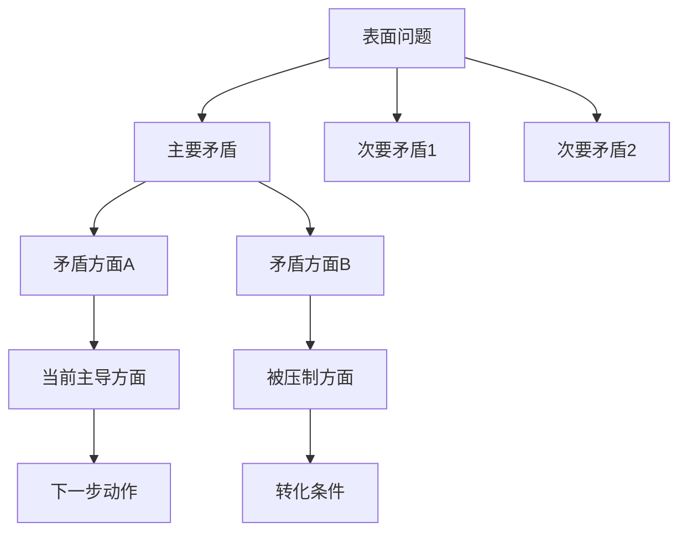
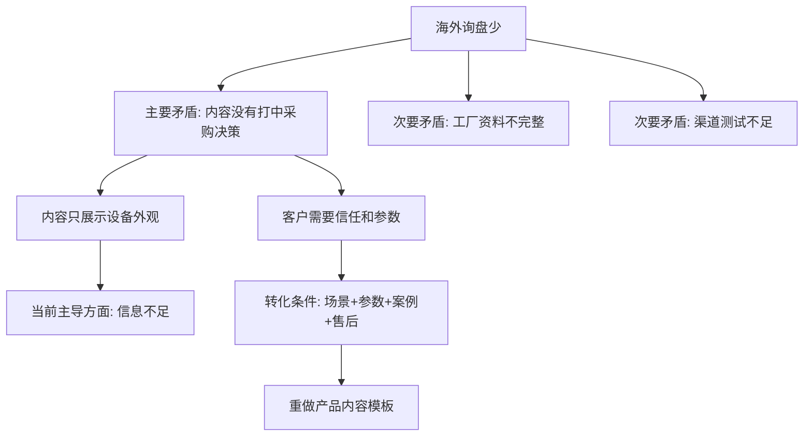

# 毛选思维模型库｜跨境社媒与AI工作流版

> 本文是一个**独立新文稿**。只整理《毛选思维模型.pdf》中的模型，不保留、不合并之前的“100个思维模型”或《模型思维》内容。

## 0. 放置建议

建议路径：

```text
18-个人学习与成长/05-思维模型库/毛选思维模型库｜跨境社媒与AI工作流版.md
```

如果你希望它更服务业务，也可以放：

```text
15-AI工作流与自动化/模型库/毛选思维模型库｜业务决策版.md
```

其他目录不要复制全文，只做双链引用：

- [[02-跨境社媒获客]]：用于客户开发、内容选题、渠道判断。
- [[03-海外投流]]：用于广告测试、预算分配、素材复盘。
- [[05-客户开发与成交]]：用于客户需求判断、异议处理、成交路径。
- [[10-食品加工机械作战体系]]：用于产品线、工厂、应用场景分析。
- [[16-知识库治理]]：用于判断哪些文稿应该保留、压缩、删除。

---

# 1. 总结：这15个模型怎么服务你的工作

你的工作不是单纯“学理论”，而是要解决这些现实问题：

1. **跨境社媒获客**：哪些内容、渠道、客户群最值得优先做？
2. **食品加工机械行业**：哪些设备、工厂、应用场景更适合做海外增长？
3. **投流与内容复盘**：为什么有的广告有点击没询盘？为什么有询盘不成交？
4. **客户成交**：客户真正纠结的是价格、信任、交付、资质，还是售后风险？
5. **AI工作流与Obsidian治理**：哪些资料该留，哪些该合并，哪些该删？

这份PDF的核心方法可以压缩成一句话：

> **不要平均用力，要先找主要矛盾；不要抽象套模板，要看具体场景；不要只看静态结果，要看矛盾如何转化。**

---

# 2. 模型分级：哪些和你最相关

## A级：必须进入你的核心模型库

这些模型与你当前工作强相关，建议作为长期调用模型。

| 编号 | 模型 | 为什么重要 | 主要应用 |
|---|---|---|---|
| 01 | 矛盾论｜形而上学 | 防止只看表面问题 | 业务诊断、客户复盘、投流复盘 |
| 02 | 矛盾论｜唯物辩证法 | 用动态关系看问题 | 市场变化、客户需求变化、AI工作流调整 |
| 03 | 对立统一法则 | 识别冲突双方如何互相依存 | 价格与质量、流量与成交、标准化与定制 |
| 05 | 矛盾的特殊性 | 不同客户、产品、市场不能一套打法 | 外贸市场细分、食品机械选品 |
| 06 | 主要矛盾 | 找最关键卡点 | 获客、成交、投流、知识库压缩 |
| 07 | 主要的矛盾方面 | 判断矛盾中哪一方占主导 | 客户是否成交、工厂是否靠谱、广告是否该加预算 |
| 12 | 矛盾分析法 | 一套完整分析工具 | 全业务复盘、项目诊断 |
| 14 | 质量互变规律 | 小量积累到质变 | 内容矩阵、广告测试、知识库治理 |
| 15 | 否定之否定规律 | 迭代升级，不是简单推翻 | 业务版本迭代、AI流程升级 |

## B级：备选模型，特定场景调用

| 编号 | 模型 | 适合什么时候用 |
|---|---|---|
| 04 | 矛盾的普遍性 | 做总盘点，发现每个系统都有矛盾 |
| 08 | 矛盾双方的同一性 | 看合作、转化、互相依赖关系 |
| 09 | 矛盾双方的斗争性 | 看竞争、冲突、价格战、谈判卡点 |
| 10 | 同一性与斗争性 | 判断合作与冲突的动态平衡 |
| 11 | 对抗在矛盾中的地位 | 判断矛盾是否必须正面对抗 |
| 13 | 矛盾逻辑图 | 做可视化诊断、搭建分析框架 |

## C级：暂存，不建议扩写

这份PDF只有15个模型，没有多余模型。暂时不设C级。后续如果把《矛盾论》《实践论》《论持久战》等继续拆成更多模型，可以再设C级暂存区。

---

# 3. 15个模型逐条提炼

## 01｜矛盾论：形而上学

### 一句话解释

形而上学的问题是：把事物看成孤立、静止、片面的东西，只看表象，不看内部矛盾和发展变化。

### 业务解释

你做跨境社媒时，最容易犯的错误是：

- 看到同行发短视频，就以为“短视频=获客”。
- 看到某个广告点击高，就以为“广告有效”。
- 看到工厂产品多，就以为“工厂适合合作”。
- 看到客户问价格，就以为“客户只关心价格”。

这就是静态看问题。

### 你的工作连接

| 场景 | 错误看法 | 正确看法 |
|---|---|---|
| 食品机械工厂筛选 | 产品多就是强 | 要看主打产品、交付能力、出口经验、售后能力 |
| Facebook投流 | 点击高就是好 | 要看询盘质量、客户国家、采购意图、成交路径 |
| LinkedIn获客 | 加好友多就是好 | 要看目标职位、行业匹配、对话推进率 |
| Obsidian治理 | 文稿多就是知识多 | 要看是否能辅助决策、是否有summary、是否有双链 |

### 使用方法

每次遇到问题，先问：

```text
我现在是不是只看了表象？
这个问题背后的内部矛盾是什么？
它是在变化，还是我把它当成静态了？
```

### AI提示词

```text
请用“反形而上学”的方式分析这个业务问题：
【粘贴问题】
要求：
1. 不只看表象。
2. 找出内部矛盾。
3. 区分短期现象和长期结构。
4. 给出我下一步最应该验证的3个问题。
```

---

## 02｜矛盾论：唯物辩证法

### 一句话解释

唯物辩证法强调：事物是联系的、发展的、由内部矛盾推动变化的。

### 业务解释

客户不成交，不只是“价格贵”；可能是多个因素互相作用：

- 设备是否解决真实生产痛点。
- 工厂是否可信。
- 视频是否讲清应用场景。
- 客户是否有采购预算。
- 客户是否担心售后和配件。

### 你的工作连接

这个模型适合做：

- 客户成交失败复盘。
- 广告效果波动分析。
- 食品机械产品线选择。
- AI工作流为什么卡顿、重复、产出垃圾的诊断。

### 使用方法

用“四连问”：

```text
1. 这个问题和哪些因素相关？
2. 哪些因素是表层因素？哪些是底层因素？
3. 哪个因素正在推动变化？
4. 我应该先改变哪一个变量？
```

### 例子

问题：食品机械短视频播放量不错，但没有询盘。

辩证分析：

- 表面矛盾：有流量，但没询盘。
- 内部矛盾：内容吸引的是泛人群，不是采购人。
- 主要矛盾：视频没有讲清“适用场景、产能、物料、痛点、交付”。
- 下一步：重做内容结构，加入工厂场景、产能参数、前后对比、客户使用场景。

---

## 03｜对立统一法则

### 一句话解释

矛盾双方既对立，又互相依存；不是简单二选一。

### 业务解释

很多业务问题不是“选A还是选B”，而是要处理A和B的关系。

| 对立双方 | 统一点 |
|---|---|
| 标准化内容 vs 定制化内容 | 先标准化框架，再按行业定制案例 |
| 低价获客 vs 高质量客户 | 用低成本内容筛选高意向客户 |
| 工厂生产能力 vs 海外营销能力 | 工厂负责产品，你负责市场表达 |
| AI自动化 vs 人工判断 | AI批量处理，人做验收和决策 |
| 图片资料保留 vs 知识库压缩 | 只保留高价值图，正文结构化 |

### 你的工作连接

尤其适合：

- 制定合作模式。
- 设计客户报价策略。
- 平衡内容数量和内容质量。
- 平衡AI自动处理和人工审核。

### 使用方法

```text
这两个看似冲突的东西，是否可以分层处理？
能不能把A变成前端筛选，把B变成后端成交？
能不能让冲突双方在不同阶段发挥作用？
```

### 例子

食品机械内容要不要专业？

- 太专业：客户看不懂。
- 太浅：没有信任。
- 统一方案：短视频用场景化语言，详情页/私信资料用专业参数。

---

## 04｜矛盾的普遍性

### 一句话解释

矛盾存在于一切事物中，任何业务系统都有矛盾。

### 业务解释

不要幻想某个项目“没有问题”。真正的高手不是找无矛盾项目，而是判断哪个矛盾值得解决。

### 你的工作连接

| 项目 | 普遍矛盾 |
|---|---|
| 外贸获客 | 流量多但信任低，客户多但质量参差 |
| 食品机械 | 产品复杂，客户不懂，交付和售后风险高 |
| 投流 | 花钱快，反馈慢，归因不清 |
| Obsidian | 文稿越多越乱，整理越多越可能重复 |
| AI工作流 | 自动化越强，错误放大越快 |

### 使用方法

先承认矛盾存在，再排序处理。

```text
这个项目有哪些不可避免的矛盾？
哪些矛盾是正常成本？
哪些矛盾会导致项目失败？
```

---

## 05｜矛盾的特殊性

### 一句话解释

不同事物有不同矛盾，不能用一套模板解决所有问题。

### 业务解释

你做食品加工机械，不能照搬服装、美妆、培训、家装的打法。

食品机械的特殊性：

- 客单价高。
- 决策链条长。
- 客户关心产能、稳定性、售后、配件、清洁维护。
- 视频必须展示真实应用场景。
- 采购人可能是工厂老板、采购经理、生产负责人、工程师。

### 你的工作连接

这是你做“食品机械作战体系”的核心模型。

| 产品 | 特殊矛盾 |
|---|---|
| 切菜机 | 客户担心切割规格、损耗、效率、清洗 |
| 清洗机 | 客户担心水耗、清洗干净程度、物料损伤 |
| 去皮机 | 客户担心去皮率、损耗率、适用物料 |
| 肉类切割设备 | 客户担心安全、冷冻程度、刀具维护 |
| 整线设备 | 客户担心方案设计、安装调试、交付周期 |

### 使用方法

每个产品都做一张“特殊性卡片”：

```text
产品：
目标客户：
使用场景：
客户最怕什么：
客户最想提升什么：
必须展示的参数：
必须展示的视频画面：
成交前必须回答的问题：
```

### AI提示词

```text
请用“矛盾特殊性”分析这个食品机械产品：
产品：【填写产品】
目标市场：【填写国家/地区】
要求输出：
1. 这个产品与其他设备不同的特殊矛盾。
2. 客户最关心的5个问题。
3. 内容拍摄必须展示的5个画面。
4. 销售话术必须回答的5个问题。
5. 不适合照搬的通用营销套路。
```

---

## 06｜主要矛盾

### 一句话解释

复杂问题里，决定整体发展的关键矛盾，叫主要矛盾。

### 业务解释

这是你最应该高频使用的模型。你现在经常同时做很多事：

- 整理Obsidian。
- 建AI工作流。
- 做食品机械行业资料。
- 找工厂。
- 做Facebook/LinkedIn获客。
- 研究投流。

如果不找主要矛盾，就会全部都做，但全部都浅。

### 你的工作连接

| 场景 | 可能的主要矛盾 |
|---|---|
| 刚开始做食品机械海外获客 | 缺少高质量产品与客户画像，不是缺工具 |
| 广告没有询盘 | 素材没有打中采购痛点，不一定是预算问题 |
| 客户不成交 | 信任与交付风险没解决，不一定是价格问题 |
| Obsidian太大 | 低价值重复文稿太多，不是目录不够漂亮 |
| AI工作流混乱 | 主控规则不清，不是Agent数量不够 |

### 使用方法

每个项目只问一个关键问题：

```text
如果我只能解决一个问题，解决哪个问题后，其他问题会明显变轻？
```

### 你的标准答案模板

```text
当前项目：
表面问题：
可能矛盾1：
可能矛盾2：
可能矛盾3：
主要矛盾判断：
为什么它是主要矛盾：
下一步动作：
```

### AI提示词

```text
请帮我判断这个项目的主要矛盾：
【粘贴项目现状】
要求：
1. 列出所有明显矛盾。
2. 区分表面矛盾和根本矛盾。
3. 选出当前阶段唯一主要矛盾。
4. 说明为什么不是其他矛盾。
5. 给出下一步3个动作。
```

---

## 07｜主要的矛盾方面

### 一句话解释

在一个矛盾中，双方力量不平均，主导的一方决定事物性质。

### 业务解释

客户是否成交，不是看“有兴趣”还是“没兴趣”，而是看成交矛盾中哪一方占主导：

- 购买动力 > 风险顾虑：可能成交。
- 风险顾虑 > 购买动力：暂时不成交。

### 你的工作连接

| 场景 | 矛盾双方 | 主导方面决定什么 |
|---|---|---|
| 客户询盘 | 需求强度 vs 风险顾虑 | 是否推进报价 |
| 广告投流 | 素材吸引力 vs 信任不足 | 是否能转询盘 |
| 工厂合作 | 产品能力 vs 配合成本 | 是否值得长期合作 |
| AI自动化 | 效率提升 vs 错误风险 | 是否允许批量写入 |
| 知识库压缩 | 保留价值 vs 混乱成本 | 是否删除/合并 |

### 使用方法

```text
这个矛盾中，哪一方现在占主导？
我能否通过一个动作改变主导方面？
```

### 例子

客户说“价格太高”。

不要立刻降价。先判断主导方面：

- 如果客户信任不足，降价没用。
- 如果客户预算不足，可以给低配方案。
- 如果客户只是谈判，可以强调交付和售后价值。

---

## 08｜矛盾双方的同一性

### 一句话解释

矛盾双方在一定条件下互相依存，并可能互相转化。

### 业务解释

客户的“反对意见”不一定是坏事，可能是成交信号。

例如：

- 客户问售后，说明他在认真考虑风险。
- 客户问交期，说明他有真实项目时间。
- 客户问价格，说明他在比较方案。
- 客户问认证，说明他考虑进口合规。

### 你的工作连接

适合用于客户沟通和销售复盘。

| 客户异议 | 可能转化成 |
|---|---|
| 太贵 | 价值解释机会 |
| 交期多久 | 项目真实度判断 |
| 有没有CE | 合规需求判断 |
| 有没有视频 | 信任建立机会 |
| 售后怎么办 | 服务方案成交点 |

### 使用方法

```text
客户的反对意见背后，隐藏了什么真实需求？
这个负面信号能不能转化成推进成交的入口？
```

---

## 09｜矛盾双方的斗争性

### 一句话解释

矛盾双方也会互相排斥、互相限制、互相竞争。

### 业务解释

不是所有问题都能靠“合作共赢”解决。有些矛盾必须明确边界。

### 你的工作连接

| 场景 | 斗争性表现 | 应对方式 |
|---|---|---|
| 客户无限压价 | 利润被压缩 | 设置底价和配置边界 |
| 工厂不配合素材 | 影响营销质量 | 明确合作条件 |
| AI乱写文稿 | 污染知识库 | 设置写入权限和验收 |
| 广告预算分散 | 无法形成数据 | 集中测试核心素材 |
| 文稿重复膨胀 | 检索效率下降 | 强制合并和删除 |

### 使用方法

```text
哪些矛盾不能妥协？
我的底线是什么？
如果继续让步，会不会破坏整个系统？
```

---

## 10｜同一性与斗争性

### 一句话解释

合作和冲突同时存在，关键是判断当前阶段哪一面更重要。

### 业务解释

你和工厂之间就是典型关系：

- 同一性：都想拿海外订单。
- 斗争性：工厂可能不愿配合内容、资料、报价透明、售后承诺。

### 你的工作连接

适合设计合作机制。

### 工厂合作判断表

| 问题 | 同一性 | 斗争性 | 策略 |
|---|---|---|---|
| 工厂想出口 | 有共同目标 | 不一定愿投入内容 | 用小样板项目测试 |
| 工厂有设备 | 有产品基础 | 不一定懂海外表达 | 你提供内容框架 |
| 工厂要客户 | 目标一致 | 可能绕开你成交 | 提前明确合作规则 |
| 工厂怕麻烦 | 可理解 | 影响素材交付 | 建立资料清单和截止时间 |

### 使用方法

```text
我和对方的共同利益是什么？
我们的冲突点是什么？
哪些冲突必须提前写清楚？
```

---

## 11｜对抗在矛盾中的地位

### 一句话解释

不是所有矛盾都是对抗性的；有些可以协调，有些必须对抗。

### 业务解释

这个模型适合帮你判断：要不要硬碰硬。

### 你的工作连接

| 场景 | 是否对抗性 | 建议 |
|---|---|---|
| 客户正常砍价 | 非对抗 | 用方案分层解决 |
| 客户恶意套方案 | 对抗 | 限制信息，保护方案 |
| 工厂轻微拖延资料 | 非对抗 | 明确清单和时间 |
| 工厂长期不配合 | 对抗 | 暂停合作或降级 |
| AI生成质量不稳 | 非对抗 | 加规则和验收 |
| AI批量误写主库 | 对抗 | 立即停止写入，回滚 |

### 使用方法

```text
这个矛盾是可以通过规则协调，还是必须切断/限制/对抗？
如果我继续温和处理，会不会造成更大损失？
```

---

## 12｜矛盾分析法

### 一句话解释

矛盾分析法是把问题拆成主要矛盾、次要矛盾、矛盾双方、主导方面、转化条件的一整套方法。

### 业务解释

这是整份PDF最适合你做“业务诊断模板”的模型。

### 标准分析框架

```text
1. 当前问题是什么？
2. 表面矛盾有哪些？
3. 深层矛盾有哪些？
4. 哪个是主要矛盾？
5. 主要矛盾中的主导方面是什么？
6. 次要矛盾有哪些？
7. 哪些矛盾可以转化？
8. 我现在最应该做什么？
```

### 你的工作连接

适合用于：

- 每周业务复盘。
- 投流复盘。
- 客户成交复盘。
- 工厂合作复盘。
- Obsidian压缩治理。
- AI多Agent任务失败复盘。

### AI提示词

```text
请用“矛盾分析法”分析下面这个项目：
【粘贴项目现状】
请输出：
1. 表面问题。
2. 主要矛盾。
3. 次要矛盾。
4. 矛盾双方。
5. 当前主导方面。
6. 可能的转化条件。
7. 本周最该做的3件事。
8. 不该做的3件事。
```

---

## 13｜矛盾逻辑图

### 一句话解释

把矛盾关系画成结构图，帮助你看清问题之间的层级与转化路径。

### 业务解释

你的Obsidian和AI工作流非常适合用这个模型。因为你经常面对的是多变量系统：

- 文稿数量。
- 目录结构。
- 双链关系。
- AI读取入口。
- 任务分工。
- 质量验收。
- 备份与同步。

### 你的工作连接

建议在Obsidian中给重大项目做“矛盾逻辑图”。

### Mermaid模板



### 食品机械获客示例



---

## 14｜质量互变规律

### 一句话解释

量变积累到一定程度，会发生质变；质变后又会开启新的量变。

### 业务解释

你做跨境社媒和AI知识库，都不能指望一次动作立刻质变。必须设计可积累的量变。

### 你的工作连接

| 项目 | 量变 | 质变 |
|---|---|---|
| Facebook内容 | 每周稳定发布高质量内容 | 出现稳定询盘和行业认知 |
| LinkedIn开发 | 每天精准连接目标客户 | 建立目标行业联系人池 |
| 食品机械知识库 | 每个产品补齐场景/参数/痛点 | 形成可调用销售作战体系 |
| AI工作流 | 每批任务复盘规则 | 形成稳定自动化生产线 |
| Obsidian治理 | 每批压缩重复文稿 | 检索效率明显提升 |

### 使用方法

```text
我现在应该积累什么量？
达到什么阈值才会发生质变？
如果迟迟没有质变，是量不够，还是方向错？
```

### 例子

食品机械内容不是发10条就能判断失败。更合理的阈值：

- 每个核心产品至少20条内容角度。
- 每个角度至少测试3种开头。
- 每个重点市场至少沉淀20个目标客户反馈。
- 有数据后再判断产品、市场、内容哪个环节有问题。

---

## 15｜否定之否定规律

### 一句话解释

发展不是简单重复，也不是简单推翻，而是在否定旧阶段后，形成更高一级的新阶段。

### 业务解释

你做AI工作流和Obsidian治理，最容易出现两种错误：

1. 旧东西全保留，导致越来越臃肿。
2. 旧东西全推翻，导致经验断层。

正确方式是：保留有价值部分，否定低效结构，升级成新系统。

### 你的工作连接

| 旧阶段 | 第一次否定 | 第二次否定/升级 |
|---|---|---|
| 文稿堆积 | 删除重复低质 | 建成模型库/MOC/AI读取入口 |
| 人工整理 | 引入AI批量处理 | 人机分工+验收机制 |
| 随机找客户 | 建客户画像 | 建渠道-内容-话术-成交闭环 |
| 单条广告测试 | 否定低效素材 | 建素材矩阵和复盘机制 |
| 工厂资料杂乱 | 去掉无效工厂信息 | 建产品/场景/客户决策数据库 |

### 使用方法

```text
我现在要否定的是什么？
哪些旧东西必须保留？
升级后的新结构是什么？
如何避免推倒重来？
```

---

# 4. 你的高频使用场景

## 场景一：食品机械产品选择

使用模型：[[矛盾的特殊性]] + [[主要矛盾]] + [[质量互变规律]]

分析模板：

```text
产品名称：
目标客户：
使用场景：
客户主要痛点：
这个产品的特殊性：
当前主要矛盾：
需要积累的内容数量：
判断质变的指标：
下一步动作：
```

## 场景二：客户成交复盘

使用模型：[[主要的矛盾方面]] + [[矛盾双方的同一性]] + [[对抗在矛盾中的地位]]

分析模板：

```text
客户来源：
客户国家：
客户需求：
客户异议：
矛盾双方：
当前主导方面：
异议能否转化为成交点：
是否存在对抗性问题：
下一步沟通策略：
```

## 场景三：Facebook/LinkedIn内容复盘

使用模型：[[矛盾分析法]] + [[质量互变规律]]

分析模板：

```text
内容主题：
数据表现：
表面问题：
主要矛盾：
内容是否打中采购痛点：
是否有场景/参数/案例/信任证据：
下一批内容如何调整：
```

## 场景四：投流复盘

使用模型：[[主要矛盾]] + [[主要的矛盾方面]] + [[质量互变规律]]

分析模板：

```text
广告目标：
素材：
国家：
预算：
点击率：
询盘率：
客户质量：
当前主要矛盾：
是素材问题、受众问题、落地页问题，还是信任问题：
下一步测试动作：
```

## 场景五：Obsidian知识库压缩

使用模型：[[主要矛盾]] + [[否定之否定规律]] + [[质量互变规律]]

分析模板：

```text
目录：
文稿数量：
重复比例：
主要矛盾：
应该否定什么：
应该保留什么：
升级后的结构：
删除/合并/保留标准：
```

## 场景六：AI多Agent工作流

使用模型：[[对立统一法则]] + [[对抗在矛盾中的地位]] + [[矛盾逻辑图]]

分析模板：

```text
任务目标：
主控Agent：
Worker分工：
写入权限：
验收标准：
主要风险：
哪些错误必须对抗/阻止：
哪些问题可以协调修正：
```

---

# 5. 模型调用优先级

## 快速判断表

| 你遇到的问题 | 优先调用模型 |
|---|---|
| 不知道先做什么 | 主要矛盾 |
| 客户有兴趣但不成交 | 主要的矛盾方面 |
| 不同市场打法不同 | 矛盾的特殊性 |
| 合作方既有价值又麻烦 | 同一性与斗争性 |
| 项目越做越乱 | 否定之否定规律 |
| 内容发了很多没效果 | 质量互变规律 + 主要矛盾 |
| AI批量处理出错 | 对抗在矛盾中的地位 |
| 想做系统复盘 | 矛盾分析法 |
| 变量太多看不清 | 矛盾逻辑图 |

---

# 6. 图片处理建议

这份PDF只有16页，其中第1页是封面，第2-16页对应15个模型。

建议：

- **不建议全部导入图片**：图片中文字密集，直接放进Obsidian会增加体积，不利于AI检索。
- **可以保留15张模型图**：如果你想视觉化学习，可以每个模型保留1张图。
- **不需要20-30张**：本PDF总页数不多，最多保留15张即可。

推荐保留图片页：

```text
page-02｜01 矛盾论：形而上学
page-03｜02 矛盾论：唯物辩证法
page-04｜03 对立统一法则
page-06｜05 矛盾的特殊性
page-07｜06 主要矛盾
page-08｜07 主要的矛盾方面
page-13｜12 矛盾分析法
page-14｜13 矛盾逻辑图
page-15｜14 质量互变规律
page-16｜15 否定之否定规律
```

如果要进一步压缩，只保留10张即可。其余内容用本文的结构化文字替代。

---

# 7. 建议新增到你的模型库索引

在你的模型库MOC里增加：

```markdown
## 中国式系统分析模型

- [[毛选思维模型库｜跨境社媒与AI工作流版]]
  - 核心用途：找主要矛盾、拆业务卡点、判断合作/冲突、做项目迭代。
  - 高频调用：食品机械产品选择、客户成交复盘、投流复盘、Obsidian压缩、AI工作流治理。
  - 核心模型：主要矛盾、矛盾特殊性、矛盾分析法、质量互变、否定之否定。
```

---

# 8. 最小使用规则

不要把15个模型都同时拿出来分析。这样会变成形式主义。

每次只选1-3个模型：

1. **先用主要矛盾**：确定关键问题。
2. **再用特殊性**：避免套模板。
3. **最后用质量互变或否定之否定**：决定下一步积累还是升级。

最实用组合：

```text
主要矛盾 → 矛盾特殊性 → 质量互变
```

用于判断：

- 我现在最该做什么？
- 为什么这个产品/客户/市场不能套通用打法？
- 我应该积累多少动作后再判断成败？

---

# 9. 一句话结论

这15个模型最适合你用来做**复杂业务判断**，不是用来背概念。你的核心用法应该是：

> 在外贸获客、食品机械产品研究、客户成交、投流复盘和AI知识库治理中，先找主要矛盾，再看具体特殊性，最后通过量变积累和结构升级推动业务质变。
